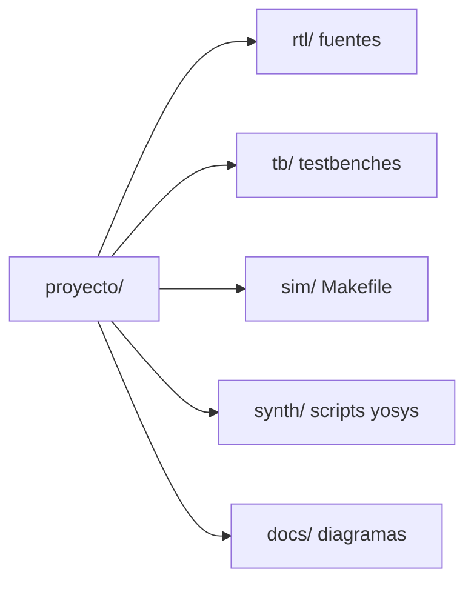

# rtl-lab

Colección de diseños digitales en SystemVerilog, simulados con Icarus Verilog
dentro del entorno [IIC-OSIC-TOOLS](https://github.com/iic-jku/IIC-OSIC-TOOLS),
y prototipos para FPGA (Quartus / Vivado).

## Proyectos

| Proyecto | Categoría | Descripción | Estado |
|---|---|---|---|
| [adder](projects/arithmetic/adder) | Aritmética | Sumador de 8 bits | 🚧 |
| [adder_subtractor](projects/arithmetic/adder_subtractor) | Aritmética | Sumador/restador de N bits | 🚧 |
| [cla_adder](projects/arithmetic/cla_adder) | Aritmética | Carry-Lookahead de 16 bits | ✅ |
| [subtractor](projects/arithmetic/subtractor) | Aritmética | Restador de 8 bits (con síntesis yosys) | 🚧 |
| [subtractor_p](projects/arithmetic/subtractor_p) | Aritmética | Restador (variante P) | 🚧 |

## Requisitos
- Docker + IIC-OSIC-TOOLS (iverilog, vvp, GTKWave, yosys, make)
- Para FPGA: Quartus Prime o Vivado

## Uso
```bash
cd projects/arithmetic/<proyecto>/sim
make run      # compila y simula
make check    # además verifica el mensaje de éxito del testbench
make wave     # abre GTKWave
make clean    # borra build/
```

## Convenciones
- Cada módulo vive en su propio archivo, **sin `` `include ``**: el Makefile compila todo `rtl/` y `tb/`.
- Todo lo generado va a `build/` y no se versiona.
- Los testbenches deben imprimir un mensaje de éxito y usar `$fatal` si fallan.

## Estructura de cada proyecto


## Licencia
Apache-2.0, ver [LICENSE](LICENSE).

## Notes

The `scripts/` folder holds an unused makefile and project-skeleton script,
kept only as a possible future automation. See `scripts/README.md`.
