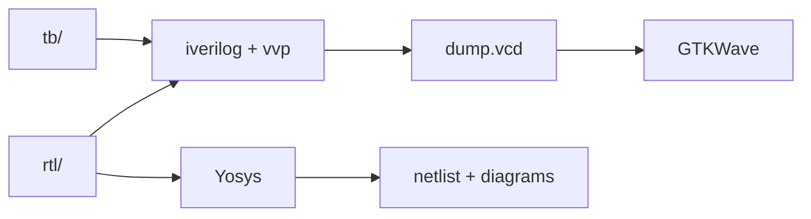

# foss-designs

A collection of digital designs written in SystemVerilog, simulated with
Icarus Verilog inside the [IIC-OSIC-TOOLS](https://github.com/iic-jku/IIC-OSIC-TOOLS)
Docker environment, plus FPGA prototypes (Quartus / Vivado).

## Projects

| Project | Category | Description | Status |
|---|---|---|---|
| [adder](projects/arithmetic/adder) | Arithmetic | 8-bit ripple-carry adder | WIP |
| [adder_subtractor](projects/arithmetic/adder_subtractor) | Arithmetic | N-bit adder/subtractor | WIP |
| [cla_adder](projects/arithmetic/cla_adder) | Arithmetic | 16-bit carry-lookahead adder | Verified |
| [subtractor](projects/arithmetic/subtractor) | Arithmetic | 8-bit subtractor, with Yosys synthesis | WIP |
| [subtractor_p](projects/arithmetic/subtractor_p) | Arithmetic | Subtractor (P variant) | WIP |

## Requirements

- Docker with IIC-OSIC-TOOLS (Icarus Verilog, GTKWave, Yosys)
- For FPGA projects: Quartus Prime or Vivado

## Project layout

```text
<project>/
├── rtl/      synthesizable sources (.sv)
├── tb/       testbenches
├── sim/      GTKWave save files (.gtkw); build/ is generated and ignored
├── synth/    Yosys scripts (.ys); build/ is generated and ignored
└── docs/     diagrams and documentation
```



## Simulating a project

Everything is done by hand from a terminal inside the Docker container.
From the project root:

```bash
mkdir -p sim/build
iverilog -g2012 -o sim/build/<project>.vvp rtl/*.sv tb/*.sv
cd sim/build
vvp <project>.vvp
gtkwave dump.vcd &
```

- `iverilog -g2012` compiles with the SystemVerilog-2012 standard.
- `vvp` runs the compiled simulation. It writes the `.vcd` file into the
  current directory, which is why we run it from `sim/build`.
- `gtkwave` opens the waveforms (view it through the VNC session).

## Conventions

- One module per file. Do not use `` `include `` for module files; the compiler
  receives every file in `rtl/` and `tb/` explicitly.
- Generated files (`.vvp`, `.vcd`, logs, netlists) live in `build/` folders and are never committed.
- Folder names are lowercase; file names match the module they contain.
- Testbenches print a clear pass/fail message.
- Everything in this repository is written in English.

## Notes

The `scripts/` folder holds an unused makefile and a project-skeleton script,
kept only as possible future automation. See [scripts/README.md](scripts/README.md).

## License

Apache-2.0, see [LICENSE](LICENSE).
