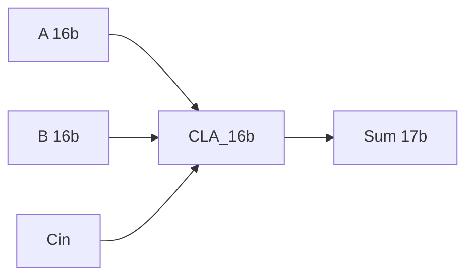

# CLA Adder (16 bits)

Sumador/restador Carry-Lookahead de 16 bits, construido con generadores de acarreo de 4 bits.

## Archivos
| Archivo | Función |
|---|---|
| `rtl/Carry_Lookahead_Generator_4b.sv` | Generador de acarreos de 4 bits (`CLG_4b`) |
| `rtl/Adder.sv` | Sumador básico (`Adder`) |
| `rtl/Carry_Lookahead_Adder_16b.sv` | Top de 16 bits (`CLA_16b`) |
| `tb/Carry_Lookahead_Adder_16b_tb.sv` | Testbench con casos dirigidos y aleatorios |

## Simulación
```bash
cd sim
make check
make wave
```

## Arquitectura

> Ajusta el diagrama a tu implementación real (4 bloques CLG_4b, etc.).
